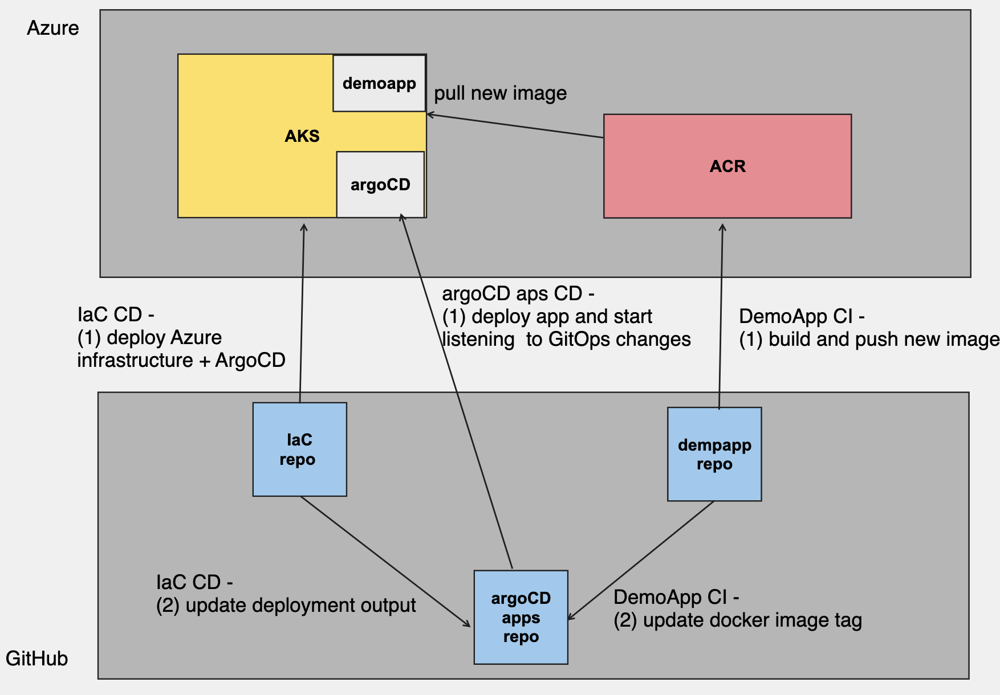

# DevOpsDemo - Iac repo

## tl;dr
This repo is one of three related repos which demonstrate a complete CI/CD pipeline using GitHub Actions implmenting DevSecOps practices using GitHub Advanced Security tools: Code Scanning (CodeQL), dependency review (depandadbot) and secret scanning. 
Additional security scanning which being used in the demo are:
1. IaC check using [Checkov](https://www.checkov.io/)
2. Container image scanning the demo using [Aqua Trivy](https://github.com/aquasecurity/trivy)

## solution diagram

## pre-requisites
1. Azure subscription
2. Under Settings of current GitHub repo - create three GitHub environments in GitHub: dev, prod, whatif. for prod environment setup a need for manual approval.
3. Configure OpenID Connect in Azure. After completing the instructions, the following secrets should be created in your repo secrets: AZURE_CLIENT_ID, AZURE_SUBSCRIPTION_ID, AZURE_TENANT_ID - you will need to add three entries for each 'Environment' types: dev, prod and whatif
4. Setup dev and main branches and use branch protection in GitHub to require Pull Request when target branch is: main

## repo review
-- infra: bicep files for Azure deployment
-- argoCD: deployment of argoCD service
-- .github/workflows: github actions files
  -- checksIaC.yaml : run checkov IaC security scan for the bicep files
  -- deployIaC.yaml : run whatif scenario, arm deployment (bicep) and argoCD installation 
